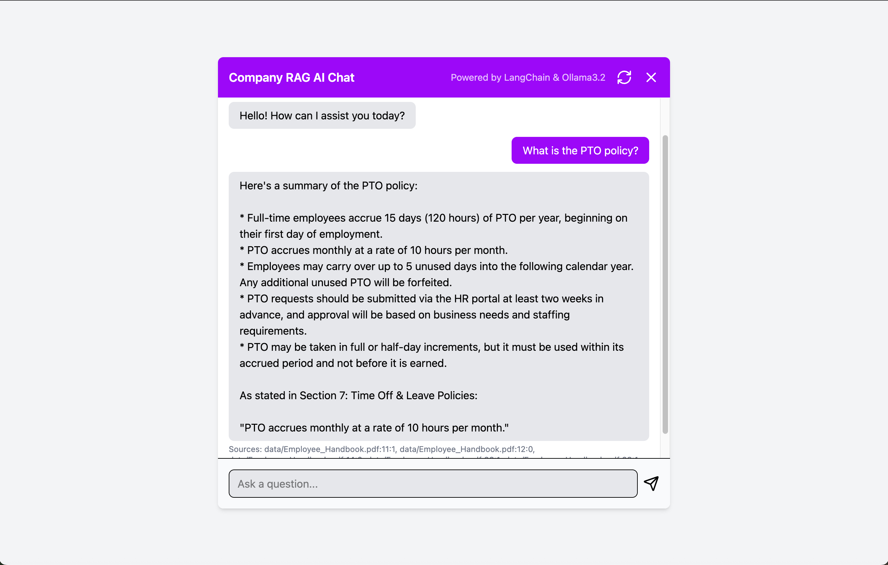

# 📘 RAG AI Employee Handbook Assistant  

An **AI-powered full-stack chatbot** that acts as an *internal knowledge assistant*.  
This project demonstrates how companies can use **Retrieval-Augmented Generation (RAG)** to provide employees with instant, AI-driven answers about internal policies and documentation.  

---

## ✨ Features
- 📄 **Document Ingestion**: Loads employee handbooks (PDF) and splits them into chunks.  
- 🧠 **RAG Pipeline**: Embeds and stores documents in **Chroma (vector DB)**.  
- 🤖 **Local LLM**: Queries are passed with relevant context to **Ollama (Llama 3.2)** for accurate answers.  
- 🎨 **Frontend UI**: Built with **React + TailwindCSS + Framer Motion** for a polished chat experience.  
- 💬 **Chat Features**:  
  - Animated open/close widget  
  - Typing indicator  
  - Date dividers  
  - Reset button  
  - Displays sources alongside answers  

---

## 🛠️ Tech Stack
**Backend**  
- FastAPI (Python)  
- LangChain (RAG + orchestration)  
- Chroma (vector database)  
- HuggingFace embeddings  
- Ollama (local LLM – Llama 3.2)  

**Frontend**  
- React  
- TailwindCSS  
- Framer Motion  
- Axios  

---

## 📸 Screenshots

### Chat UI


### Demo Animation


---

## 🚀 Getting Started

### Prerequisites
- Python 3.10+  
- Node.js & npm  
- [Ollama](https://ollama.ai) installed locally  

---

### Backend Setup
```bash
# Clone repo
git clone https://github.com/Andi-Cast/Company_RAG_AI.git
cd Company_RAG_AI/backend

# Create virtual environment
python -m venv venv
source venv/bin/activate   # On Mac/Linux
venv\Scripts\activate      # On Windows

# Install requirements
pip install -r requirements.txt

# Run FastAPI server
uvicorn main:app --reload --port 8000
